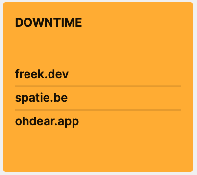

This tile displays sites that [Oh Dear](https://ohdear.app) detects as down.



## Installation

You can install the package via composer:

```bash
composer require spatie/laravel-dashboard-oh-dear-tile
```

This package listens for event coming from Oh Dear using the `ohdearapp/laravel-ohdear-webhooks` package. Before you can use this tie, you most for set up `laravel-ohdear-webhooks`. You'll find instructions at [in this section in the Oh Dear docs](https://ohdear.app/docs/integrations/webhooks/laravel-package).

In the `dashboard` config file, you must add this configuration in the `tiles` key. The `ids` should contain any calendar id that you want to display on the dashboard.

```php
// in config/dashboard.php

return [
    // ...
    'tiles' => [
        'oh_dear_uptime' => [
            'refresh_interval_in_seconds' => 5,
        ],
];
```

## Usage

In your dashboard view you use the `livewire:calendar-tile` component. You should pass the calendar id for your calendar to the `calendar-id` property.

```html
<x-dashboard>
    <livewire:oh-daer-uptime-tile position="a1:a3" />
</x-dashboard>
```

### Customizing the view

If you want to customize the view used to render this tile, run this command:

```bash
php artisan vendor:publish --provider="Spatie\OhDearUptimeTile\OhDearUptimeTileServiceProvider" --tag="dashboard-oh-dear-uptime-tile-views"
```
